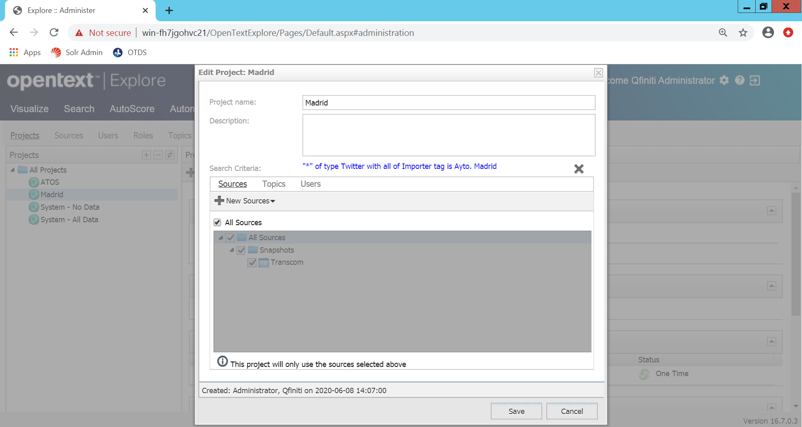

# Applying changes on your instance

Once you have modified **Explore.Configuration.xml** and **schema.xml** files you must follow these steps:

 - Execute this command from a terminal/console as Administrator:

```
c:> cd c:\SolrCloud\solr-7.3.1\bin

c:\SolrCloud\solr-7.3.3\bin> solr.cmd zk -z 127.0.0.1 upconfig -d c:\SolrCloud\solr-7.3.3\server\solr\configsets\interaction_config -n interaction_config 
```

- Open a browser and access to this URL: 

```
http://localhost:8983/solr/admin/collections?action=RELOAD&name=interaction&wt=xml
```


		
- Reset IIS from a terminal/console as administrator:

```
c:> iisreset
```

Once the configuration has been updated Explore will look like this:


## Create a new Project in Explore

In order to manage content from different client in the same instance in a demo environment you can create projects that keep together the info for each client. 

Follow this steps:

 - Open your Explore instance.
 - Click on **Administer** in the top menu.
 - Click on **Projects**
 - Click on **New** (+ icon)
 - Set the **Project name**: MyProject
 
 
 
 - Click on **Search Criteria**
 - Provide the required fields:
    - Search expression: *
    - Types:  Ticket
    - Include results that have "all" of the followings:
       - Imported tag: is Ticket 
 
 
 
> NOTE: the value used on the "Imported tag" is the same value that you have used in the **itag** parameter.
