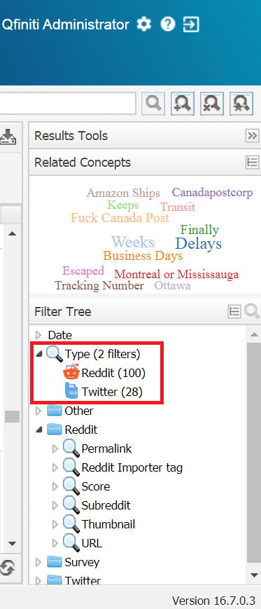
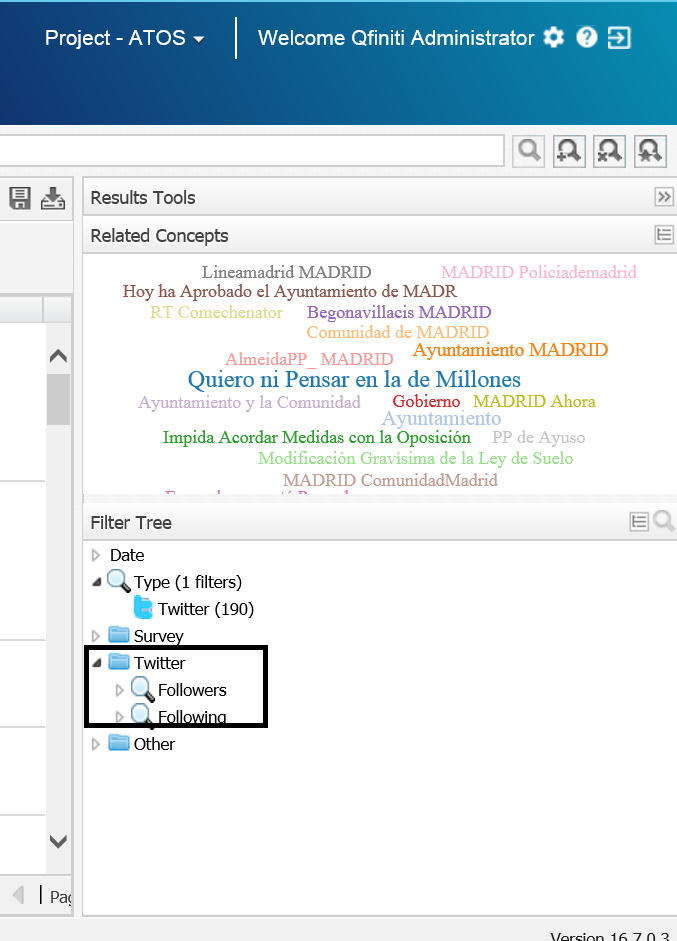

# OpenText Explore Tripadvisor Importer

This command-line application read a tripadvisor.com reviews page about a company.

These comments are inserted into the Solr Server used by **OpenText Explore**. 

Once the reviews are available in **OpenText Explore** you can create your owns dashboards to analyze the information listened.


> [OpenText™ Explore](https://www.opentext.com/products-and-solutions/products/customer-experience-management/contact-center-workforce-optimization/opentext-explore) is a business discovery solution that allows business and call center professionals to view cross-channel interactions collectively for a comprehensive picture of customer behaviors and relationships. 

## Command line execution 

This utility is distributed as a runnable .jar file.

These are the accepted parameters:

```
$ java -jar  OTExploreMultiImporter-tripadvisor-22.09.01
usage: java -jar OTExploreMultiImporter-tripadvisor-22.09.01 --itag Tripadvisor --search "Club Med"
 -h,--host <arg>    Solr URL. Default value: http://localhost:8983
 -i --itag <arg>    Explore Importer tag. Added to each article importer. Default value `TripaAdvisor Review`
 -e --exact         Exact match. If set the search term must be contained in the page title or url
 -s --search        Search term to look for in tripadvisor.com
 -c --consumers     Number of consumers (threads) used simultaneously to scrap the page.
```

### Example of invocation

```
$ java -jar OTExploreMultiImporter-tripadvisor-22.09.01 --search "Club Med" --itag Tripadvisor
```

## Explore configuration

### Explore.Configuration.xml

The configuration file **Explore.Configuration.xml** is located at **<EXPLORE_HOME>\Explore.Configuration.xml**, e.g. 

```
D:\Program Files (x86)\OpenText\Explore\Explore.Configuration.xml 
```

### Tripadvisor DocType

We must add a new DocType tag under the **<DocTypes>** in Explore.Configuration.xml in order to identify Tripadvisor as a new input/document type analyzed by Explore:

```xml
  <DocTypes>
    ... 
    <DocType> 
      <Name>Tripadvisor</Name>
      <GridFields>
        <Field column="Source">
          <Name>Rating value</Name>
          <Tag>ratingValue</Tag>
        </Field>
        <Field column="Source">
          <Name>Facility name</Name>
          <Tag>facility_name</Tag>
        </Field>
      </GridFields>	   
      <DetailFields>             
        <Field>
          <Name>Facility name</Name>
          <Tag>facility_name</Tag>
        </Field>
        <Field>
          <Name>Facility address</Name>
          <Tag>facility_address</Tag>
        </Field>
        <Field>
          <Name>Facility phone</Name>
          <Tag>facility_phone</Tag>
        </Field>
        <Field>
          <Name>Facility web</Name>
          <Tag>facility_web</Tag>
        </Field>
        <Field>
          <Name>Tripadvisor tag</Name>
          <Tag>ttag</Tag>
        </Field>      
      </DetailFields>                   
    </DocType>            
  </DocTypes>
```




### Group Tripadvisor


We must add a new **Group** tag under the **<DoCriteriaItemscTypes>** in Explore.Configuration.xml in order to identify 
Tripadvisor as a new group that can be used to filter by:

```xml
  <!--<CriteriaItem parametric="true" advancedSearch="true" trendWidget="true" autoPopulate="true" reloadUserData="true" groupBy="single" numberBuckets="6">
    parametric:     Show criteria item in the filter section on the search tab. Default value: false
    advancedSearch: Show criteria in the advanced search dialog. . Default value: true
    trendWidget:    Display criteria in the trend widget settings dialog. Only to be used with numeric criterias. Default value: false
    reloadUserData: Allows to reload user values for a parametric criteria. EG MAS Source. Default value: false
    groupBy:        Allows to group values in 3 ways: "single", "numeric" or "alphabetical"
    numberBuckets:  Number of buckets when gruping using numeric or alphabetical. Default value: 5
    numericStats:   Numeric criteria to be used in the Statistical Summary or in the High and Low Comparison widget.    
    -->

  <CriteriaItems>
  
    ...
      
    <Group name="Tripadvisor">	             
      <CriteriaItem parametric="true" groupBy ="numeric" numberBuckets="10" advancedSearch="true" numericStats="true">
        <Name>Rating value</Name>
        <Tag>ratingValue</Tag>
        <ComparatorGroup>numeric</ComparatorGroup>
        <AssociatedDocTypes>
          <DocType>Tripadvisor</DocType>
        </AssociatedDocTypes>
      </CriteriaItem>

      <CriteriaItem parametric="true" groupBy ="alphabetical" numberBuckets="20">
        <Name>Facility name</Name>
        <Tag>facility_name</Tag>
        <ComparatorGroup>string</ComparatorGroup>
        <AssociatedDocTypes>
          <DocType>Tripadvisor</DocType>
        </AssociatedDocTypes>
      </CriteriaItem>
      
      <CriteriaItem parametric="true" groupBy ="alphabetical" numberBuckets="20">
        <Name>Facility phone</Name>
        <Tag>facility_phone</Tag>
        <ComparatorGroup>string</ComparatorGroup>
        <AssociatedDocTypes>
          <DocType>Tripadvisor</DocType>
        </AssociatedDocTypes>
      </CriteriaItem>

      <CriteriaItem parametric="true" groupBy ="alphabetical" numberBuckets="20">
        <Name>Tripadvisor tag</Name>
        <Tag>ttag</Tag>
        <ComparatorGroup>string</ComparatorGroup>
        <AssociatedDocTypes>
          <DocType>Tripadvisor</DocType>
        </AssociatedDocTypes>
      </CriteriaItem>            
    </Group>  
  
    ...
  
  </CriteriaItems>    
```


## schema.xml (Solr)

The Solr configuration file **schema.xml** is located at **<SOLR_HOME>\solr-7.3.1\server\solr\configsets\interaction_config** e.g. 

```
D:\SolrCloud\solr-7.3.1\server\solr\configsets\interaction_config
```

### New Tripadvisor fields on Solr

We must define new fields to be able to import extra metadata related with each Twitt 

```xml

  <!-- ADD YOUR CUSTOM FIELDS HERE -->

  <field name="ratingValue" type="pint" indexed="true" stored="false" docValues="true" />
  <field name="ratingValue_search" type="explore_filter_text" indexed="true" stored="false" multiValued="true" />
  <copyField source="ratingValue" dest="ratingValue_search" />
   
  <field name="facility_name" type="string" indexed="true" stored="false" docValues="true" />
  <field name="facility_name_search" type="explore_filter_text" indexed="true" stored="false" multiValued="true" />
  <copyField source="facility_name" dest="facility_name_search" />

  <field name="facility_address" type="string" indexed="true" stored="false" docValues="true" />
  <field name="facility_address_search" type="explore_filter_text" indexed="true" stored="false" multiValued="true" />
  <copyField source="facility_address" dest="facility_address_search" />

  <field name="facility_phone" type="string" indexed="true" stored="false" docValues="true" />
  <field name="facility_phone_search" type="explore_filter_text" indexed="true" stored="false" multiValued="true" />
  <copyField source="facility_phone" dest="facility_phone_search" />

  <field name="facility_web" type="string" indexed="true" stored="false" docValues="true" />
  <field name="facility_web_search" type="explore_filter_text" indexed="true" stored="false" multiValued="true" />
  <copyField source="facility_web" dest="facility_web_search" />

  <field name="ttag" type="string" indexed="true" stored="false" docValues="true" />
  <field name="ttag_search" type="explore_filter_text" indexed="true" stored="false" multiValued="true" />
  <copyField source="ttag" dest="ttag_search" />

  <!-- END CUSTOM FIELDS -->
```

> **NOTE:** Field must be named using lower case


## Apply the changes on your instance
Please, see [apply the changes on your instance](./applying-changes-on-your-instance.md)
