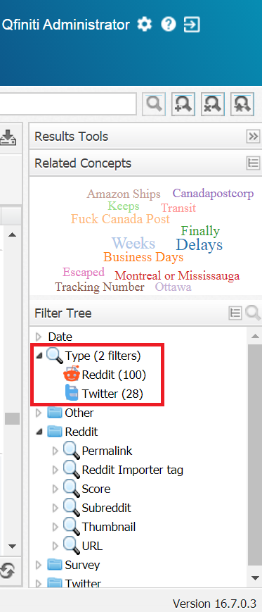

# OpenText Explore Trustpilot Importer

This command-line application read a trustpilot.com opinions page about a company.

These comments are inserted into the Solr Server used by **OpenText Explore**. 

Once the comments are available in **OpenText Explore** you can create your owns dashboards to analyze the information listened.


> [OpenText™ Explore](https://www.opentext.com/products-and-solutions/products/customer-experience-management/contact-center-workforce-optimization/opentext-explore) is a business discovery solution that allows business and call center professionals to view cross-channel interactions collectively for a comprehensive picture of customer behaviors and relationships. 

## Command line execution 

This utility is distributed as a runnable .jar file.

These are the accepted parameters:

```
$ java -jar  OTExploreMultiImporter-trustpilot-22.02.14.jar
usage: java -jar OTExploreTrustImporter.22.02.16.jar --itag Trustpilot
            --alias bancsabadell.com
 -a,--alias <arg>   Trustpilot client alias, e.g. In
                    https://www.trustpilot.com/review/bancsabadell.com the
                    alias is 'bancsabadell.com'
 -h,--host <arg>    Solr URL. Default value: http://localhost:8983
 -i,--itag <arg>    Explore Importer tag. Added to each article importer
 -t,--time <arg>    Seconds between each call against Trustpilot.com.
                    Default value 300 secs (5 minutes).
 -u,--url <arg>     Trustpilot URL base, e.g. https://www.trustpilot.com
                    or https://es.trustpilot.com
```

### Example of invocation

```
$ java -jar OTExploreMultiImporter-trustpilot-22.02.14.jar --alias bancsabadell.com --url https://es.trustpilot.com
```


## Explore configuration

### Explore.Configuration.xml

The configuration file **Explore.Configuration.xml** is located at **<EXPLORE_HOME>\Explore.Configuration.xml**, e.g. 

```
D:\Program Files (x86)\OpenText\Explore\Explore.Configuration.xml 
```

### Twitter DocType

We must add a new DocType tag under the **<DocTypes>** in Explore.Configuration.xml in order to identify Twitter as a new input/document type analyzed by Explore:

```xml
  <DocTypes>
    ... 
    <DocType> 
      <Name>Twitter</Name>
      <GridFields>
        <Field column="Source">
          <Name>Followers</Name>
          <Tag>followers</Tag>
        </Field>
        <Field column="Source">
          <Name>Following</Name>
          <Tag>following</Tag>
        </Field>
        <Field column="Source">
          <Name>Favorite count</Name>
          <Tag>favorite_count</Tag>
        </Field>
        <Field column="Source">
          <Name>Retweet count</Name>
          <Tag>retweet_count</Tag>
        </Field>
        <Field column="Source">
          <Name>Latitude</Name>
          <Tag>latitude</Tag>
        </Field>
        <Field column="Source">
          <Name>Longitude</Name>
          <Tag>longitude</Tag>
        </Field>
        <Field column="Source">
          <Name>Importer Tag</Name>
          <Tag>itag</Tag>
        </Field>
      </GridFields>	          
    </DocType>            
  </DocTypes>
```




### Group Twitter


We must add a new **Group** tag under the **<DoCriteriaItemscTypes>** in Explore.Configuration.xml in order to identify Twitter as a new group that can be used to filter by:

```xml
  <!--<CriteriaItem parametric="true" advancedSearch="true" trendWidget="true" autoPopulate="true" reloadUserData="true" groupBy="single" numberBuckets="6">
    parametric:     Show criteria item in the filter section on the search tab. Default value: false
    advancedSearch: Show criteria in the advanced search dialog. . Default value: true
    trendWidget:    Display criteria in the trend widget settings dialog. Only to be used with numeric criterias. Default value: false
    reloadUserData: Allows to reload user values for a parametric criteria. EG MAS Source. Default value: false
    groupBy:        Allows to group values in 3 ways: "single", "numeric" or "alphabetical"
    numberBuckets:  Number of buckets when gruping using numeric or alphabetical. Default value: 5
    numericStats:   Numeric criteria to be used in the Statistical Summary or in the High and Low Comparison widget.    
    -->

  <CriteriaItems>
  
    ...
      
    <Group name="Twitter">	             
      <CriteriaItem parametric="true" groupBy ="numeric" numberBuckets="10" advancedSearch="true" numericStats="true">
        <Name>Following</Name>
        <Tag>following</Tag>
        <ComparatorGroup>numeric</ComparatorGroup>
        <AssociatedDocTypes>
          <DocType>Twitter</DocType>
        </AssociatedDocTypes>
      </CriteriaItem>

      <CriteriaItem parametric="true" groupBy ="numeric" numberBuckets="10" advancedSearch="true" numericStats="true">
        <Name>Followers</Name>
        <Tag>followers</Tag>
        <ComparatorGroup>numeric</ComparatorGroup>
        <AssociatedDocTypes>
          <DocType>Twitter</DocType>
        </AssociatedDocTypes>		
      </CriteriaItem>
	  
      <CriteriaItem parametric="true" groupBy ="numeric" numberBuckets="10" advancedSearch="true" numericStats="true">
        <Name>Favorite count</Name>
        <Tag>favorite_count</Tag>
        <ComparatorGroup>numeric</ComparatorGroup>
        <AssociatedDocTypes>
          <DocType>Twitter</DocType>
        </AssociatedDocTypes>		
      </CriteriaItem>
	  
      <CriteriaItem parametric="true" groupBy ="numeric" numberBuckets="10" advancedSearch="true" numericStats="true">
        <Name>Retweet count</Name>
        <Tag>retweet_count</Tag>
        <ComparatorGroup>numeric</ComparatorGroup>
        <AssociatedDocTypes>
          <DocType>Twitter</DocType>
        </AssociatedDocTypes>		
      </CriteriaItem>	  
    </Group>  
  
    ...
  
  </CriteriaItems>    
```


## schema.xml (Solr)

The Solr configuration file **schema.xml** is located at **<SOLR_HOME>\solr-7.3.1\server\solr\configsets\interaction_config** e.g. 

```
D:\SolrCloud\solr-7.3.1\server\solr\configsets\interaction_config
```

### New Twitter fields on Solr

We must define new fields to be able to import extra metadata related with each Twitt 

```xml

  <!-- ADD YOUR CUSTOM FIELDS HERE -->

  <field name="followers" type="pint" indexed="true" stored="false" docValues="true" />
  <field name="followers_search" type="explore_filter_text" indexed="true" stored="false" multiValued="true" />
  <copyField source="followers" dest="followers_search" />

  <field name="following" type="pint" indexed="true" stored="false" docValues="true" />
  <field name="following_search" type="explore_filter_text" indexed="true" stored="false" multiValued="true" />
  <copyField source="following" dest="following_search" />

  <field name="favorite_count" type="pint" indexed="true" stored="false" docValues="true" />
  <field name="favorite_count_search" type="explore_filter_text" indexed="true" stored="false" multiValued="true" />
  <copyField source="favorite_count" dest="favorite_count_search" />

  <field name="retweet_count" type="pint" indexed="true" stored="false" docValues="true" />
  <field name="retweet_count_search" type="explore_filter_text" indexed="true" stored="false" multiValued="true" />
  <copyField source="retweet_count" dest="retweet_count_search" />
    
  <field name="latitude" type="pfloat" indexed="true" stored="false" docValues="true" />
  <field name="latitude_search" type="explore_filter_text" indexed="true" stored="false" multiValued="true" />
  <copyField source="latitude" dest="latitude_search" />

  <field name="longitude" type="pfloat" indexed="true" stored="false" docValues="true" />
  <field name="longitude_search" type="explore_filter_text" indexed="true" stored="false" multiValued="true" />
  <copyField source="longitude" dest="longitude_search" />
    
  <field name="itag" type="string" indexed="true" stored="false" docValues="true" />
  <field name="itag_search" type="explore_filter_text" indexed="true" stored="false" multiValued="true" />
  <copyField source="itag" dest="itag_search" />


  <!-- END CUSTOM FIELDS -->
```

> **NOTE:** Field must be named using lower case


## Apply the changes on your instance
Please, see [apply the changes on your instance](.(applying-changes-on-your-instance.md)