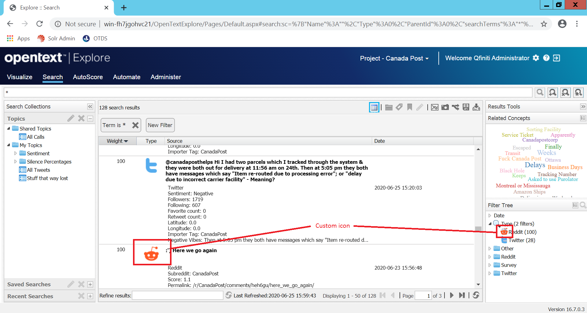

# Tips & Tricks


## Customize the icon of your Doc Type

Each document type defined in Explore has his own icon. All the icons are stored on **[EXPLORE_HOME]\ExploreWeb\resources\images\icons** and follos this pattern:

```
explore_custom_icon_[DOC_TYPE_NAME_IN_LOWERCASE]_doc_type.png
```

where:

 * explore_custom_icon_: Prefix
 * [[DOC_TYPE_NAME_IN_LOWERCASE]]: Document type name in lowercase
 * _doc_type.png: Suffix
 
In our example:

```
icn_multichannel_reddit_16.png
```

> A 32x32 pixel image is recommended. 

You must copy the Reddit logo, called **icn_multichannel_reddit_16.png**, from the **img** folder in this project and paste on the **[[EXPLORE_HOME]]\ExploreWeb\resources\images\icons** of your Explore instance, e.g.

```
D:\Program Files (x86)\OpenText\Explore\ExploreWeb\resources\images\icons
```




## Removing all the imported  inputs

During your test you can decide to remove all inputs imported. The fastest way to do it is just executing this command from a terminal/console as administrator:

> NOTE: This will delete all the data in your Solr instance!

```
d:> cd d:\SolrCloud\solr-7.3.3\example\exampledocs

d:\SolrCloud\solr-7.3.3\example\exampledocs> java -Dc=interaction -Ddata=args -Dcommit=true -jar post.jar "<delete><query>*:*</query></delete>"
```

> NOTE: The path of your Solr installation can vary in your environment.

If you just want to remove a specific content type you, .e.g. `Ticket` you can use a new query:

```
d:> cd d:\SolrCloud\solr-7.3.3\example\exampledocs

d:\SolrCloud\solr-7.3.3\example\exampledocs> java -Dc=interaction -Ddata=args -Dcommit=true -jar post.jar "<delete><query>itag: Ticket</query></delete>"
```

